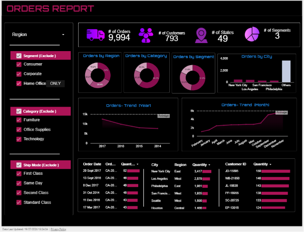

# orders_report-Looker_Dashboard
#  Orders Report Dashboard | Google Looker Studio

## Overview :
This project showcases an interactive Orders Report Dashboard built using Google Looker Studio. The dashboard demonstrates data visualization and reporting through interactive charts, KPI cards, filters, and tables.

## Dataset :
The dashboard is built using a provided retail orders dataset containing transactional sales data. The dataset includes information related to customers, products, orders, shipping, and sales performance.

## Tool Used :
- Google Looker Studio

## Dashboard Features :
- Total Orders
- Total Customers
- Total States
- Total Segments
- Orders by Region
- Orders by Category
- Orders by Segment
- Orders by City
- Year-wise Order Trend
- Month-wise Order Trend
- Interactive Filters

## Dashboard Preview :

## Live Dashboard :
https://datastudio.google.com/reporting/c5591406-eff2-4daa-b8d9-02442ea2d5dd

## Note :
The dataset used in this project was provided. My contribution was designing and developing the interactive dashboard in Google Looker Studio.

##  Author : Sanjana Patil
